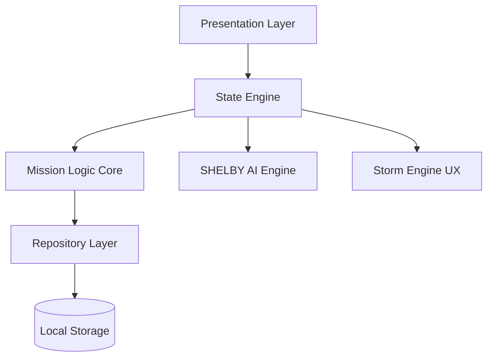

<h1 align="center">⚡ HabitX</h1>

<p align="center">
  <strong>Neural Mission Protocol • AI-Driven Cognitive Performance System</strong>
</p>

<p align="center">
  A high-performance, offline-first productivity engine designed for developers, creators, 
  and elite performers — powered by local AI intelligence, premium glassmorphic UX, and 
  immersive sensory gamification feedback.
</p>

---

## 🏆 Badges

<p align="center">


[](https://flutter.dev)
[]()
[]()
[]()

</p>

---

## 🎥 Demo

> ⚠️ Sensory Immersion Tap & Hold Dial Animation
* Normal tap: Triggers elastic scale bounce and a dual-layer expanding ripple effect.
* Tap-and-Hold: Simulates an environmental storm overlay featuring wind, lightning sheet flashes, rainfall, and rumbling haptics.


---

## ⚡ Core Systems

### 🧠 SHELBY AI v4.0 (Contextual Intelligence)
A local, privacy-first offline heuristic analysis engine that optimizes performance:
* **Focus Strike Protocols**: Smart pomodoro modes targeting 15m, 25m, or 45m sessions depending on daily completion rates.
* **Neural Status Checks**: Context-aware daily briefings split across 4 distinct phases (Morning Briefing, Mid-Day Audit, Evening Push, Nightly Reflection).
* **Zero Cloud Dependence**: Code operates entirely on device for absolute confidentiality.

### ⛈ Sensory Storm Engine (Interactive Dial UX)
Bridges virtual productivity milestones with immersive physical feedback:
* 🏓 **Micro-Animations**: Dial scale compression on tap coupled with color-gradient radial ripples.
* ⛈ **Weather Simulation Overlay**: Particle systems rendering slanted falling rain drops and wavy wind vectors.
* ⚡ **Lightning Sheet Flashes**: Full-screen white ambient flashes timed with weather gusts.
* 🔊 **Rumbling Haptics**: Immersive synchronizations playing heavy impact device haptics during storm peaks.

### 📡 Resilient Notification Architecture
Designed to survive aggressive OEM battery-saving kills and OS reboots:
* ⚡ **Reboot Resiliency**: `ScheduledNotificationBootReceiver` starts automatically on device boot (`RECEIVE_BOOT_COMPLETED`) to reschedule habit alerts.
* 🛡 **Security Exception Fallbacks**: Automatically checks runtime exact alarm capabilities (`SCHEDULE_EXACT_ALARM`). If restricted, falls back gracefully to inexact alarms (`inexactAllowWhileIdle`) to prevent application crashes while guaranteeing alerts.
* 🔋 **Battery Optimization Exceptions**: Direct access tiles allowing users to exclude HabitX from background throttling.

### 🕶 Dynamic Glassmorphism Color System
* **Light Mode**: Delicate milk-glass containers sitting over bright sky-blue and lavender gradients.
* **Dark Mode**: Smoked dark-glass layers resting on top of a deep midnight obsidian-sapphire base gradient.
* **Glow Effects**: Dual neon magenta and indigo glow orbs positioned to float behind active widgets.
* **Dynamic Contrast**: Fully theme-adaptive typography and icons shifting dynamically to guarantee legibility.

---

## 🧠 System Architecture



---

## 🏗 Architecture Breakdown

| Layer | Responsibility |
|------|---------------|
| Presentation | Dynamic Glassmorphism layouts, custom painters, and Storm overlays |
| State Engine | Centralized ChangeNotifier state tracking & Shared Preference triggers |
| Logic Core | Gamified level algorithms, xp trackers, and notification schedules |
| Data Layer | Offline Shared Preferences JSON storage systems |
| AI Layer | SHELBY cognitive logic analyzer |

---

## 📂 Project Structure

```text
lib/
├── core/           # Constants, haptic helpers, styling configurations
├── data/           # Data models, services, local databases
├── domain/         # State structures, core models
├── presentation/   # UI widgets, glass overlays, interactive screens
└── main.dart
```

---

## 🔒 Security Architecture

* 🚫 **No Cleartext Traffic**: Enforces absolute HTTPS security through `android:usesCleartextTraffic="false"`.
* 🔐 **Secure ADB Backup Prevention**: Enforces `android:allowBackup="false"` to block database and user metadata extraction.
* 🧠 **Offline Processing Only**: Core analytics process entirely locally on the processor.

---

## 🧪 Testing Suite

Includes complete release-ready automated testing pipelines:
* 🧪 **Unit Tests (`test/habit_provider_test.dart`)**: Verifies state transitions, onboarding metrics, and preference changes (Haptics, Daily Motivations) saving correctly to disk.
* 🎨 **Widget Tests (`test/widget_test.dart`)**: Verifies element rendering, text strings, and layout bounds of glass components in a mock MaterialApp environment.

---

## ⚙️ Setup Guide

### 1. Clone Repository
```bash
git clone https://github.com/Shalcontech/HabitX.git
```

### 2. Install Dependencies
```bash
flutter pub get
```

### 3. Run Automated Checks
```bash
flutter test
```

### 4. Run Application
```bash
flutter run --release
```

---

## 🚀 Roadmap

- [ ] Biometric authentication (FaceID / Fingerprint)  
- [ ] AI-generated monthly reports  
- [ ] Deep Focus Mode (App Blocking)  
- [ ] Multi-persona AI system  
- [ ] Cross-device sync  

---

## 👨‍💻 Author

**Ashraf**  
Flutter Engineer • AI Systems Builder  

- LinkedIn  
- Portfolio  
- Contact  

---

## ⭐ Support

If this project impressed you:

- ⭐ Star the repo  
- 🍴 Fork it  
- 🚀 Share it  

---

<p align="center">
  <b>“Discipline engineered. Performance amplified.”</b>
</p>
