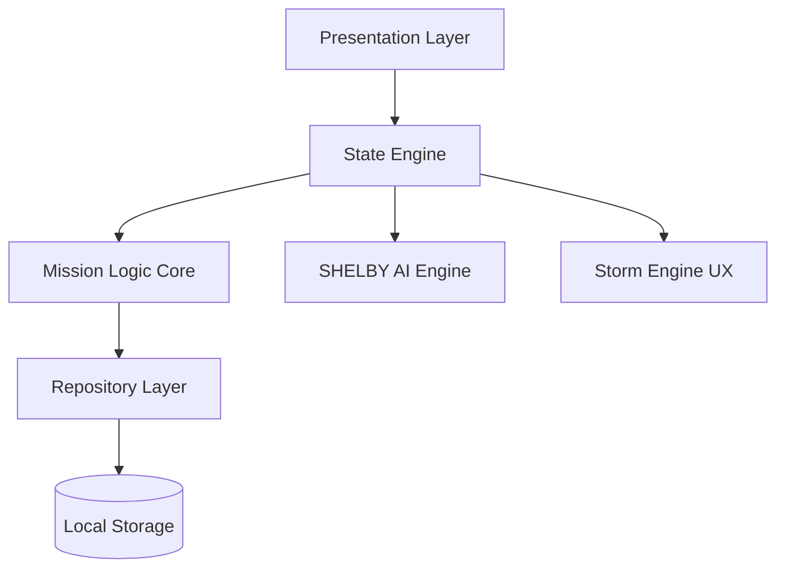

<h1 align="center">⚡ HabitX</h1>

<p align="center">
  <strong>Neural Mission Protocol • AI-Driven Cognitive Performance System</strong>
</p>

<p align="center">
  A high-performance, offline-first productivity engine designed for developers, creators, 
  and elite performers — powered by AI intelligence, gamified feedback systems, and 
  real-time cognitive optimization.
</p>

---

## 🏆 Badges

<p align="center">


[](https://flutter.dev)
[]()
[]()
[]()

</p>

---

## 🎥 Demo (Critical Section)

> ⚠️ Recruiters WILL look here first — add a real demo

### 🎬 Suggested Demo Flow
- Neural onboarding sequence  
- Creating a mission (habit)  
- Completing a mission → XP + Storm Engine  
- AI briefing (SHELBY)  
- Performance analytics  

📌 Add your demo:


---

## 📱 System Interface

| Neural Init | Mission Control | AI Briefing |
|------------|----------------|-------------|
|  |  |  |

---

## ⚡ Core Systems

### 🧠 SHELBY AI v4.0 (Cognitive Engine)

A contextual intelligence layer that optimizes performance through adaptive logic.

- ⚡ **Focus Strike Protocols**
  - Auto-switch between 10m sprint & 50m deep work  
- 📊 **Neural Status Checks**
  - 4-phase daily cognitive briefings  
- 🧠 **Behavior Analysis**
  - Tracks patterns to optimize productivity cycles  

---

### ⛈ Storm Engine (Sensory UX System)

Transforms productivity into a **physical experience**.

- ⚡ Lightning-based XP feedback (`CustomPainter`)
- 🔊 Multi-layer haptic simulation (Thunder + Zap)
- 🎮 Gamified feedback loop

---

### 📡 Dual Notification Engine

Designed to defeat OS background limitations.

- 🧱 **Persistent Layer**
  - `flutter_local_notifications`
- 🚨 **Tactical Layer**
  - Custom high-priority alerts system  

---

## 🧠 System Architecture



---

## 🏗 Architecture Breakdown

| Layer | Responsibility |
|------|---------------|
| Presentation | UI, animations, interaction |
| State Engine | Provider (central logic) |
| Logic Core | Habit rules & AI triggers |
| Data Layer | Local persistence |
| AI Layer | SHELBY intelligence |

---

## 📂 Project Structure

```text
lib/
├── core/           # Theme, utilities, engines
├── data/           # Models & storage
├── presentation/   # UI + Providers
└── main.dart
```

---

## ⚙️ Setup Guide

### 1. Clone Repository
```bash
git clone https://github.com/Shalcontech/HabitX.git
```

### 2. Install Dependencies
```bash
flutter pub get
```

### 3. Run Application
```bash
flutter run --release
```

---

## 🔒 Security Architecture

- 🚫 Zero cloud dependency  
- 🔐 Device-level encryption  
- 🧠 Fully local cognitive processing  

---

## 🚀 Roadmap

- [ ] Biometric authentication (FaceID / Fingerprint)  
- [ ] AI-generated monthly reports  
- [ ] Deep Focus Mode (App Blocking)  
- [ ] Multi-persona AI system  
- [ ] Cross-device sync  

---

## 💼 Why HabitX Stands Out

HabitX demonstrates:

- 🧠 Advanced system design thinking  
- ⚙️ Production-grade Flutter architecture  
- 🤖 AI-driven feature engineering  
- 🎮 Unique gamification engine  
- 🔒 Privacy-first engineering  

---

## 🧪 Engineering Highlights

- Clean Architecture implementation  
- Offline-first system design  
- Modular & scalable codebase  
- Custom rendering with `CustomPainter`  
- Advanced notification handling system  

---

## 👨‍💻 Author

**Ashraf**  
Flutter Engineer • AI Systems Builder  

- LinkedIn  
- Portfolio  
- Contact  

---

## ⭐ Support

If this project impressed you:

- ⭐ Star the repo  
- 🍴 Fork it  
- 🚀 Share it  

---

<p align="center">
  <b>“Discipline engineered. Performance amplified.”</b>
</p>
